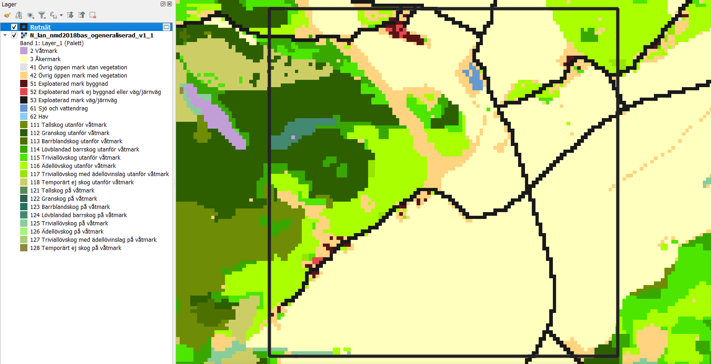
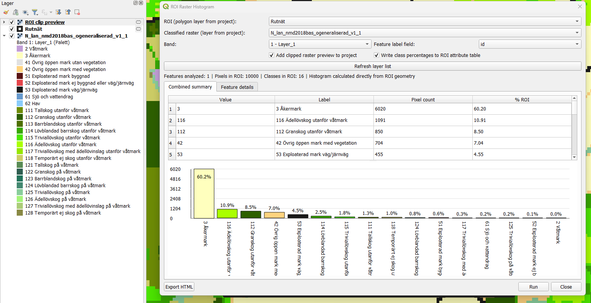
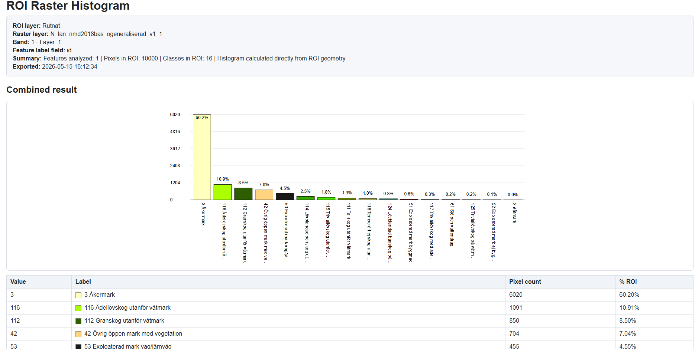

# ROI Raster Histogram QGIS

**Status:** MAINTAINED
**Type:** Free QGIS plugin
**Recommended QGIS version:** QGIS 3.40 LTR or newer
**Installation method:** QGIS plugin ZIP package from GitHub Releases

ROI Raster Histogram QGIS is a small QGIS plugin for calculating class distribution statistics inside polygon ROI features.

The plugin is intended for classified raster layers, for example land cover, vegetation classes, habitat classes, rasterized analysis results, or other integer-coded raster datasets. It calculates how much of each raster class occurs inside each polygon feature and presents the results as tables, charts, and an optional HTML report.

---

## Main features

* Calculate raster class distribution inside polygon ROI features.
* Work with classified raster layers.
* Process multiple ROI polygons in one run.
* Show combined summary statistics for all selected ROI features.
* Show detailed per-feature histograms.
* Display summary charts directly in the plugin window.
* Export an HTML report with tables and charts.
* Optionally write class percentage values back to the ROI attribute table.
* Read class labels from raster styling / renderer information when available.

---

## Screenshots

### Input data in QGIS

Example input view with a classified raster layer and polygon ROI features loaded in QGIS.

<p align="center">
  
</p>

### Plugin results

ROI Raster Histogram after processing the selected raster and polygon ROI layer.

<p align="center">
  
</p>

### Exported HTML report

Example of the exported HTML report with summary tables and charts.

<p align="center">
  
</p>

---

## Installation

Install the plugin using the prepared QGIS plugin ZIP package from the GitHub Releases page.

Do **not** use the automatically generated GitHub **Source code (zip)** file as a QGIS plugin package. The source archive is meant for developers and may contain the repository structure, temporary files, documentation folders, or other files that are not part of the installable QGIS plugin package.

### Install from ZIP in QGIS

1. Download the latest plugin ZIP from the GitHub Releases page.
2. Open QGIS.
3. Go to `Plugins → Manage and Install Plugins`.
4. Open the `Install from ZIP` tab.
5. Select the downloaded plugin ZIP file.
6. Click `Install Plugin`.
7. Enable `ROI Raster Histogram` in the plugin list.

The ZIP package should contain one plugin folder with the required QGIS plugin files:

```text
ROI_raster_histogram_QGIS/
├── metadata.txt
├── __init__.py
├── roi_raster_histogram.py
├── LICENSE
├── README.md
└── CHANGELOG.md
```

---

## Basic workflow

1. Open a QGIS project.
2. Load a classified raster layer.
3. Load a polygon layer with ROI features.
4. Start the `ROI Raster Histogram` plugin.
5. Select the raster layer.
6. Select the ROI polygon layer.
7. Choose the raster band and ROI label field.
8. Run the analysis.
9. Review the combined summary and per-feature results.
10. Optionally export an HTML report.
11. Optionally write class percentage fields back to the ROI attribute table.

---

## Input data

### Raster layer

The raster should be a classified raster, usually with integer class values.

Typical examples:

* Land cover classes.
* Vegetation classes.
* Habitat classes.
* Binary masks.
* Rasterized vector classifications.
* Remote sensing classification outputs.

The plugin is not intended for continuous rasters such as elevation, temperature, NDVI, or other floating-point surfaces unless they have first been reclassified into discrete classes.

### ROI polygon layer

The ROI layer should contain polygon features defining the areas where raster class statistics should be calculated.

Recommended format:

* GeoPackage (`.gpkg`) for normal use.
* Temporary memory layer for quick tests.
* Shapefile only for simple cases, because field name length is limited.

A label/name field is useful but not strictly required. It makes per-feature results easier to read.

---

## Output

The plugin can produce several types of output.

### Combined summary

A combined table summarizing raster class distribution across all processed ROI features.

Typical columns include:

* Raster class value.
* Class label, when available.
* Pixel count.
* Percentage.

### Per-feature results

Each ROI feature receives its own histogram summary. This allows comparison between individual polygons.

### HTML report

The HTML report can include:

* Input layer names.
* Combined summary table.
* Combined chart.
* Per-feature tables.
* Per-feature charts.

The report is intended as a quick human-readable result that can be shared, archived, or used for documentation.

### Optional attribute update

The plugin can optionally write percentage values back to the ROI attribute table.

This is useful when the calculated class shares should be used in further GIS analysis, styling, filtering, or reporting.

Recommended format for this workflow: **GeoPackage**.

Shapefile is not recommended for this option because of field name length limitations.

---

## Notes and limitations

* The plugin is designed for classified rasters, not continuous raster analysis.
* Very large rasters or very large polygon layers may take longer to process.
* Raster and vector layers should use compatible coordinate reference systems.
* For best results, use clean polygon geometries.
* Attribute writing should be tested on a copy of the data first.
* GeoPackage is recommended when writing calculated values back to the ROI layer.

---

## Repository structure

```text
ROI_raster_histogram_QGIS/
├── README.md
├── LICENSE
├── CHANGELOG.md
├── ROADMAP.md
├── requirements.txt
├── .gitignore
├── .gitattributes
├── metadata.txt
├── __init__.py
├── roi_raster_histogram.py
├── docs/
│   ├── development.md
│   ├── testing.md
│   └── screenshots/
│       ├── 01_input_data.png
│       ├── 02_plugin_results.png
│       └── 03_html_report.png
├── sample_data/
│   └── README.md
└── scripts/
    └── package_plugin.py
```

The root directory is kept compatible with the QGIS plugin structure. The main plugin files remain in the repository root so that the folder can be used as a QGIS plugin directory during development.

---

## Development notes

This repository is kept intentionally simple.

Current priorities:

1. Keep the plugin installable through a clean QGIS plugin ZIP package.
2. Keep public repository content safe and understandable.
3. Avoid storing real, private, large, generated, or temporary GIS data in the repository.
4. Improve code structure gradually without breaking the working plugin.

Temporary files should be kept outside the repository or in a local `TEMP/` folder that is ignored by Git.

---

## Testing checklist

Before publishing a release, verify that:

* The plugin installs correctly from the prepared ZIP package.
* QGIS detects the plugin and enables it without Python errors.
* The plugin window opens correctly.
* A classified raster and polygon ROI layer can be selected.
* The analysis runs without errors.
* Combined summary results are created.
* Per-feature results are created.
* Percentages look logical and sum to approximately 100% per ROI.
* HTML export works.
* Optional attribute writing works on a test GeoPackage.

---

## Release notes

Use GitHub Releases for public plugin ZIP packages.

Recommended release naming:

```text
Tag: v0.1.0
ZIP asset: ROI_raster_histogram_QGIS_v0_1_0.zip
QGIS metadata version: 0.1.0
```

The release ZIP should be a prepared QGIS plugin package, not the automatically generated GitHub source archive.

---

## License

This project is licensed under the MIT License.

See `LICENSE` for details.

---

## Author

Created and maintained by Jakub Pelka.
